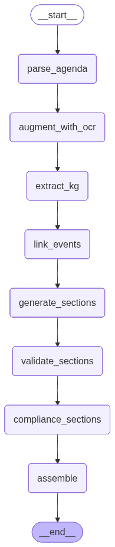
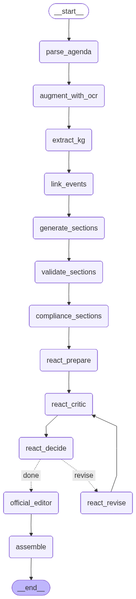

# Meeting Minutes GraphRAG + ReAct

ระบบนี้สร้างรายงานการประชุมจาก `agenda + transcript` ด้วย LangGraph และ Typhoon โดยเน้น 2 เรื่อง:
- รายงานต้องละเอียดและอ้างอิงหลักฐานได้
- ภาษาต้องเป็นทางการใกล้รูปแบบเอกสารรายงานประชุมจริง

## Workflow Diagrams

### Standard Workflow (`/generate`)


### ReAct + Official Editor Workflow (`/generate_react`)


## Techniques ที่ใช้

1. **LangGraph Multi-Agent Orchestration**
- `parse_agenda -> extract_kg -> link_events -> generate_sections -> validate_sections -> compliance_sections -> assemble`
- สำหรับ ReAct เพิ่ม loop ตรวจแก้:
  `react_prepare -> react_critic -> react_decide -> react_revise (loop)`

2. **Evidence Retrieval ต่อวาระ**
- ดึง `segment_ids` ที่เกี่ยวข้องจาก transcript ต่อวาระ
- สร้าง evidence block ให้ model เขียนจากหลักฐานแทนการเดา

3. **Token-Safe Typhoon Client**
- ประมาณ token จากขนาดข้อความ
- auto-adjust `max_tokens` ตาม error `required=...`
- shrink evidence อัตโนมัติเมื่อ prompt ใหญ่เกิน budget

4. **ReAct / Reflexion Short Loop**
- ใช้ checker ภายในโค้ดวัด:
  - โครงสร้างรายงาน
  - coverage ตาม checklist วาระ
  - off-scope ratio
- ถ้าไม่ผ่าน จะ rewrite เฉพาะ section ที่มีปัญหาแล้ววนรอบสั้น

5. **Official Editor Pass (เพิ่มใน `/generate_react`)**
- Rewrite รายงานทีละวาระให้เป็น “ภาษาทางการ”
- Prompt บังคับ style/structure ชัดเจน:
  - `ประเด็นหารือ`
  - `มติที่ประชุม`
  - `การดำเนินการ (Action Plan)`
- Inject reference context:
  - รายชื่อบุคคลจากผู้เข้าประชุม
  - glossary จาก agenda
  - agenda scope
- ใส่ few-shot ตัวอย่างแปลง “ภาษาพูด -> ภาษารายงาน”
- บังคับความแม่นยำชื่อเฉพาะและตัวเลขจากหลักฐาน

6. **Local ReAct Runner (`test_flow.py`)**
- รัน `WORKFLOW_REACT` ตรงจากไฟล์ input
- มี official editor pass เช่นเดียวกับ endpoint
- เลือกได้ว่าจะใส่รูปจากวิดีโอหรือไม่ (`--with-images`)

## LangGraph Multi-Agent Detail

### Agents ใน Standard Flow (`/generate`)

| Node | Agent | หน้าที่หลัก |
|---|---|---|
| `parse_agenda` | `AgendaParserAgent` | แปลง `agenda_text` เป็นโครงสร้างวาระ (`ParsedAgenda`) |
| `extract_kg` | `ExtractorAgent` | สกัด `speaker/topic/action/decision` จาก transcript แบบ chunk และรวมเข้า KG |
| `link_events` | `LinkerAgent` | จับคู่ `actions/decisions` กับวาระที่ถูกต้องและอัปเดตความสัมพันธ์ในกราฟ |
| `generate_sections` | `GeneratorAgent` | ดึง evidence ต่อวาระจากกราฟแล้วเขียน section (outline -> html fragment) |
| `validate_sections` | `SectionValidationAgent` | ตรวจโครง/ตาราง/ความละเอียดของ section และ rewrite เฉพาะที่ไม่ผ่าน |
| `compliance_sections` | `ComplianceAgent` | วัด coverage checklist และ off-scope ต่อวาระ แล้ว rewrite ให้ตรงวาระ |
| `assemble` | `AssembleAgent` | รวมทุก section เป็นรายงาน HTML สุดท้าย |

### Agents เพิ่มเติมใน ReAct Flow (`/generate_react`)

| Node | Agent | หน้าที่หลัก |
|---|---|---|
| `react_prepare` | `ReActPrepareAgent` | เตรียม state สำหรับ loop (checklist map, loop counters) |
| `react_critic` | `ReActCriticAgent` | ประเมินแต่ละวาระด้วย tool checks (structure/coverage/off-scope) |
| `react_decide` | `ReActDecideAgent` | จุดตัดสินใจว่าจะ `done` หรือ `revise` |
| `react_revise` | `ReActReviseAgent` | rewrite เฉพาะวาระที่ไม่ผ่าน แล้ววนกลับไป critic |
| `official_editor` | `OfficialEditorAgent` | rewrite รอบสุดท้ายให้เป็นภาษาทางการ พร้อม reference list + few-shot + evidence snippets |

### Routing Logic (ReAct)

- ถ้า `react_critic` พบว่ายังไม่ผ่านเกณฑ์ และจำนวนรอบยังไม่เกิน `REACT_MAX_LOOPS`:
  `react_decide -> react_revise -> react_critic`
- ถ้าผ่านเกณฑ์หรือครบจำนวนรอบ:
  `react_decide -> official_editor -> assemble`

## Endpoints

### `POST /generate`
ใช้ Standard workflow (เร็วกว่า, ไม่มี ReAct loop)

### `POST /generate_react`
ใช้ ReAct workflow + Official Editor pass (ภาษาทางการกว่า)

## วิธีรัน API

```bash
cd /Users/supanus/Desktop/bankky_howto_sumer
source .venv/bin/activate
python meeting_minutes_graphrag_fastapi.py
```

Server:
- `http://0.0.0.0:8011`

## วิธีรัน Test Flow

### แบบไม่ใส่รูป (ค่า default)
```bash
cd /Users/supanus/Desktop/bankky_howto_sumer
source .venv/bin/activate
.venv/bin/python test_flow.py \
  --config data/config_2025-01-04.json \
  --transcript data/transcript_2025-01-04.json
```

### แบบใส่รูปจากวิดีโอ
```bash
.venv/bin/python test_flow.py \
  --config data/config_2025-01-04.json \
  --transcript data/transcript_2025-01-04.json \
  --video data/video1862407925.mp4 \
  --with-images
```

## Key Config (Environment Variables)

- `TYPHOON_API_KEY`
- `TYPHOON_MODEL`
- `TYPHOON_CONTEXT_WINDOW`
- `TYPHOON_MAX_REQUEST_TOKENS`
- `EXTRACT_MAX_SEGMENTS`, `EXTRACT_OVERLAP_SEGMENTS`, `EXTRACT_MAX_PARALLEL`
- `GEN_EVIDENCE_MAX_CHARS`, `GEN_EVIDENCE_MAX_IDS`
- `REACT_MAX_LOOPS`, `REACT_TARGET_COVERAGE`, `REACT_MAX_OFFSCOPE_RATIO`
- `REACT_OFFICIAL_EDITOR_ENABLED` (default `1`)
- `OFFICIAL_EDITOR_COMPLETION_TOKENS`, `OFFICIAL_EDITOR_MAX_PARALLEL`
